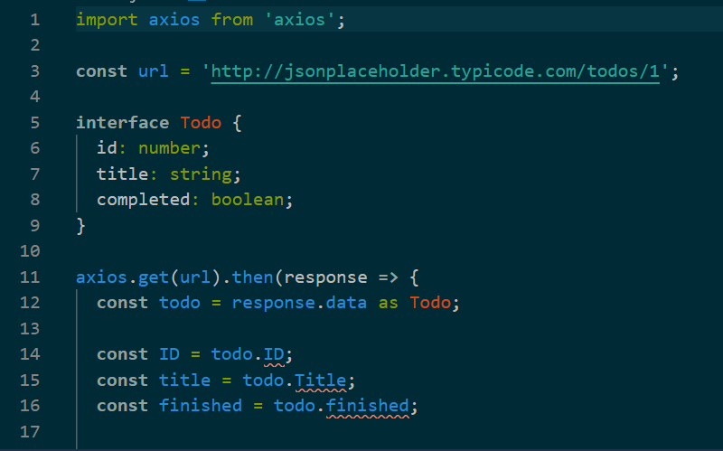
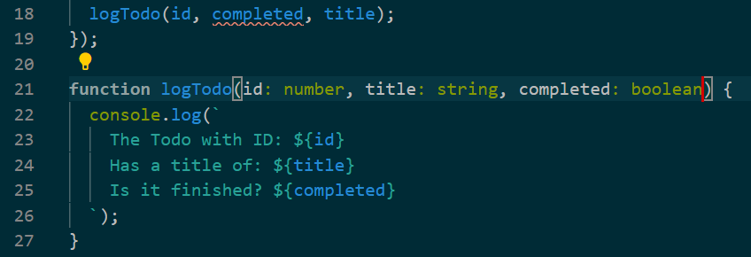

# Section 1. Getting Started with Typescript

Typescript란 무엇인가

- Javscript에 Type system을 추가한 것을 Typescript라고 할 수 있다
- 물론 Javscript에는 없고 Typescript에만 있는 추가된 기능도 있다(Superset)
- Typescript로 작성된 코드는 결국 Javascript로 변환된다

Typescript의 이점

- Type system의 도움을 받아 IDE의 지원을 보다 풍부하게 받을 수 있다
  - 자바스크립트는 버그를 발견하기 위해 직접 실행해보지 않으면 안되는 상황이 많다
  - 물론 타입스크립트를 사용한다고 해서 모든 버그를 잡아주는 것은 아니다(ex. Logical Error)
  - 그러나 타입스크립트의 type annotation을 이용하면 바보같은 실수를 줄일 수 있다
  - 바보 같은 실수란 예를 들어 문자열을 넘겨줘야 하는 함수에 숫자를 넘겨주는 행위 등이 있다

오해하지 말아야 할 점

- Typescript의 type system은 성능 최적화를 해주지는 않는다
- 브라우저, NodeJS등은 타입스크립트 코드를 읽는 것이 아니다
- 변환된 자바스크립트 코드를 그대로 읽기 때문에 성능의 향상 같은 것은 없다

Typescript의 역할을 쉽게 설명한다면

- 코딩할 때 뒤에서 앉아서 어떤 실수를 하고 있는지 도와주는 친구 정도로 생각할 수 있다

Typescript환경 설정하기

```terminal
$ npm i -g typescript ts-node
```

간단한 프로그램으로 Typescript 맛보기

- 특정 API에서 데이터를 가져오는 프로그램을 만들 것이다
- 다음 순서대로 진행한다
  1. 데이터를 가져올 API 알아보기
  2. 프로젝트 디렉토리 생성
  3. package.json파일 생성
  4. API요청을 위한 axios 패키지 설치
  5. 코드 작성하기

데이터를 가져올 API 알아보기

- https://jsonplaceholder.typicode.com
- Fake JSON Data를 제공해주는 사이트다
- /todos 경로에 있는 데이터를 가져와볼 것이다
- /todos/:userId 경로로 호출하면 개별 todo 데이터에 접근할 수 있다

프로젝트 디렉토리 생성

```terminal
$ mkdir fetchjson
$ cd fetchjson
```

- fetchjson이라는 프로젝트 디렉토리를 생성하고 이동한다

package.json파일 생성

```terminal
$ npm init -y
```

- 위 명령어로 package.json파일을 기본설정으로 생성한다

API요청을 위한 axios 패키지 설치

```terminal
$ npm i --save axios
```

코드 작성하기

- 우선 index.ts파일을 생성한다
- 앞서 말했던 API을 axios를 이용해 호출하는 코드를 작성한다

```ts
import axios from 'axios';

const url = 'http://jsonplaceholder.typicode.com/todos/1';

axios.get(url).then(response => {
  console.log(response.data);
});
```

- javascript로 변환하기

```terminal
$ tsc index.ts
```

- 같은 경로에 index.js파일이 생성된 것을 확인할 수 있을 것이다

* node로 index.js파일 실행해보기

```terminal
$ node index.js
```

- http://jsonplaceholder.typicode.com/todos/1의 데이터를 콘솔에서 볼 수 있을 것이다

* 앞서 typescript와 같이 설치했던 ts-node패키지를 사용하면 위의 두 작업을 함께 해준다

```terminal
$ ts-node index.ts
```

- index.ts를 index.js로 변환하고 node index.js로 파일을 실행해준다

코드를 수정해보기

- 앞서 호출했던 API는 다음과 같은 데이터를 가지고 있다

```js
{ userId: 1,
  id: 1,
  title: 'delectus aut autem',
  completed: false }
```

- 여기서 userId를 제외한 정보만 추가적인 설명과 함께 보여주도록 수정해보자

index.ts 수정하기

```ts
import axios from 'axios';

const url = 'http://jsonplaceholder.typicode.com/todos/1';

axios.get(url).then(response => {
  const todo = response.data;

  const ID = todo.ID;
  const title = todo.Title;
  const finished = todo.finished;

  console.log(`
    The Todo with ID: ${ID}
    Has a title of: ${title}
    Is it finished? ${finished}
  `);
});
```

- 수정을 완료했으면 ts-node index.ts를 다시 실행해보자

결과 확인하기

```txt
The Todo with ID: undefined
Has a title of: undefined
Is it finished? undefined
```

- 위와 같은 결과가 나왔을 것이다
- 예리한 사람이라면 왜 위와 같은 결과가 나왔는지 눈치챘을 수도 있다

다시 한번 API의 데이터를 확인하기

```js
{
  userId: 1,
  id: 1,
  title: "delectus aut autem",
  completed: false
}
```

- id, title프로퍼티 key는 전부 소문자로 되어 있다
- 그리고 finished가 아닌 completed가 올바른 프로퍼티 이름이다
- 위와 같은 실수가 멍청한 사람이나 하는 극단적인 예처럼 보일 수도 있지만 오타로 인한 에러 때문에 많은 시간을 디버깅해야 하는 상황을 겪어본 사람이 대부분이다
- Typescript의 기능을 활용하면 간단한 몇몇 코드로 이러한 실수를 없앨 수 있다

Typescript의 interface기능을 활용해 실수 방지하기


- interface로 데이터 타입을 명확하게 규정했다
- 규정한 interface를 실제 데이터에 as 키워드를 사용해 적용했다
- 그러자 아래에 잘못 작성된 코드들이 에러라는 것을 IDE가 알려주고 있다
- 이렇게 interface를 사용하면 실수를 바로잡아 주는 것은 물론이고 자동완성의 편리함까지 누릴 수 있다
- 이제 다시 터미널에 CLI로 \$ ts-node index.ts 를 입력해보자
- 다음과 같은 데이터가 반환됐을 것이다

```txt
The Todo with ID: 1
Has a title of: delectus aut autem
Is it finished? false
```

로그 기능을 외부 함수로 분리하기

```ts
import axios from 'axios';

const url = 'http://jsonplaceholder.typicode.com/todos/1';

interface Todo {
  id: number;
  title: string;
  completed: boolean;
}

axios.get(url).then(response => {
  const todo = response.data as Todo;

  const id = todo.id;
  const title = todo.title;
  const completed = todo.completed;

  logTodo(id, completed, title);
});

function logTodo(id, title, completed) {
  console.log(`
    The Todo with ID: ${id}
    Has a title of: ${title}
    Is it finished? ${completed}
  `);
}
```

- 변수 이름을 ID, finished에서 id, completed로 변경했다
- 로그를 남기는 기능을 외부 함수로 분리시켰다
- 저장하고 터미널에 \$ ts-node index.ts로 실행해보자
- 다음과 같은 결과가 나올 것이다

```txt
The Todo with ID: 1
Has a title of: false
Is it finished? delectus aut autem
```

- 데이터 자체는 문제없이 받아왔지만 출력하고자 하는 변수의 위치가 잘못되어 있다
- 위의 logTodo 함수의 구현에는 인자를 id, title, completed순서로 지정해놓았지만 실제 호출때는 id, completed, title순서로 호출했기 때문이다
- 함수는 인자를 순서대로 받아들여 매핑하기 때문에 이런 실수는 의도치 않은 결과로 이어질 수 있다

인자의 타입을 지정해서 실수 방지하기


- 인자에 콜론을 입력하고 자료형을 지정했다
- 그러자 함수호출부에서 자료형이 다른 파라미터를 넘겨서 에러가 발생하고 있음을 확인할 수 있다
- 이렇게 간단한 기능 만으로도 많은 실수를 줄일 수 있다
