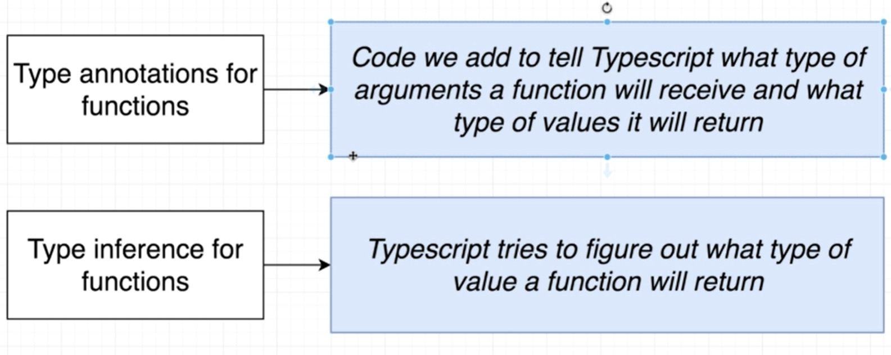
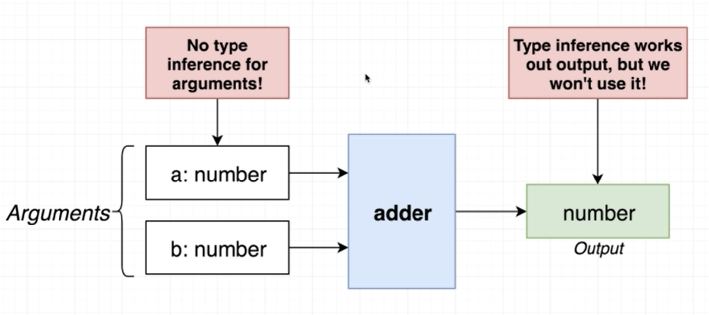
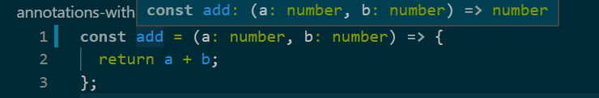

함수와 어노테이션 함수와 인퍼런스


- 어노테이션으로 타입스크립트에 인자와 리턴타입 모두 알려주는 것이 가능
- 인퍼런스는 타입스크립트가 어떤 타입이 리턴되는지를 추론

함수와 어노테이션

```ts
const add = (a: number, b: number): number => {
  return a + b;
};
```

- (인자1: 타입, 인자2: 타입, ...): 타입 형식으로 인자의 타입과 리턴 타입을 지정한다

---

함수와 인퍼런스


- 함수의 인자에는 인퍼런스를 사용할 수 없다
- 함수의 반환값에는 타입 어노테이션을 적용한 인자들을 사용하면 인퍼런스 효과를 얻을 수 있다
- 그럼에도 불구하고 함수의 리턴값에도 인퍼런스를 사용하지 않는 것이 좋다

함수의 리턴 타입에 인퍼런스가 적용된 예시


- 리턴 타입에 대한 어노테이션을 지웠음에도 인퍼런스를 통해 리턴 타입의 정보를 얻고 있다

함수에 인퍼런스를 사용하지 않는 것이 좋은 이유

```ts
const subtract = (a: number, b: number) => {
  a - b;
};
```

- 위 사례처럼 어노테이션을 적용하지 않은 경우 타입스크립트가 에러를 발생시키지 않는 경우가 있다
- 이처럼 함수에 어노테이션을 사용하면 실수할 확률이 높아지므로 함수에는 인퍼런스를 사용하지 않는 것이 좋다
