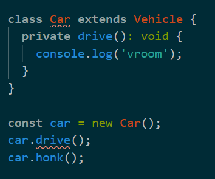
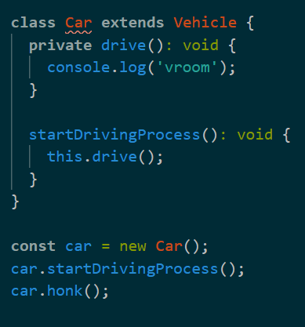

클래스 사용하기

```ts
class Vehicle {
  drive(): void {
    console.log('chugga chugga');
  }

  honk(): void {
    console.log('beep');
  }
}

const vehicle = new Vehicle();
vehicle.drive();
vehicle.honk();
```

- 메소드를 만들고 인스턴스를 만드는 방법 등 기초적인 것들은 대부분 비슷하다

```ts
class Car extends Vehicle {
  drive(): void {
    console.log('vroom');
  }
}
```

- extends 키워드로 상속을 받을 수 있다
- 부모 객체의 메소드와 동일한 이름의 메소드를 만들면 오버라이딩된다
- 여기까지는 ES6의 클래스와 타입 시스템을 이용하는 것을 제외하면 같다

---

Modifiers

- Modifier(접근제한자)는 다른 객체나 변수로부터의 접근을 허용하거나 막기 위해 사용한다
- TS에는 public, private, protected가 있다
- public은 어느 객체, 변수에서든지 접근이 가능하다
- private은 오직 클래스 내부에서만 접근할 수 있다
- protected는 클래스 내부, 그리고 자식 메소드까지도 접근이 가능하다



- private은 오직 클래스 내부에서만 접근이 가능하므로 외부에서 호출하면 에러가 발생한다



- 외부에서 접근할 수 있는 메서드를 만들어 호출하면 해당 에러는 사라진다
- 그러나 Car에는 여전히 에러가 남아 있는데 이는 상속받은 Vehicle 클래스의 drive 메서드와 자식 클래스의 drive 메서드의 접근 제한자가 다르기 때문이다
- 이 문제를 해결하려면 Vehicle의 drive 메서드를 지우거나 Car의 접근제한자를 변경해야 한다

```ts
class Vehicle {
  private honk(): void {
    console.log('beep');
  }
}

class Car extends Vehicle {
  private drive(): void {
    console.log('vroom');
  }

  startDrivingProcess(): void {
    this.drive();
    this.honk(); // Error
  }
}
```

- 자식 클래스인 Car에서 상속받은 honk메서드를 호출하고 있지만 에러가 발생한다
- 부모 클래스의 메서드인 honk의 접근제한자가 private이면 자식메서드라도 접근할 수 없기 때문이다
- 이를 호출하고 싶을 때 protected를 사용한다

```ts
class Vehicle {
  protected honk(): void {
    console.log('beep');
  } // OK
}
```

```ts
const vehicle = new Vehicle();
vehicle.honk(); // Error
```

- 하지만 protected역시 private과 마찬가지로 클래스 외부에서는 접근이 불가능하므로 위 코드는 에러가 발생한다
