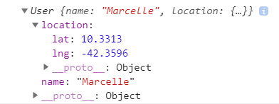

이 챕터에서 만들 앱


사용할 모듈

```terminal
$ npm i -g parcel-bundler
```

- ts를 브라우저에서 실행할 수 있는 편리한 환경을 제공해준다

parcel bundler사용법

```html
<!-- index.html -->
<html>
  <body>
    <script src="src/index.ts"></script>
  </body>
</html>
```

```ts
// src/index.ts
console.log('Hi there');
```

```terminal
parcel index.html(임의의 html파일이름)
```

- 위와 같은 간단한 코드가 있다고 가정했을 때, 이 CLI를 실행하면 parcel bundler가 ts파일을 컴파일해 브라우저에서 실행시켜준다

사용자의 좌표를 임의의 값으로 설정해줄 faker 라이브러리 설치

```terminal
npm install faker
```

지금부터 코드의 작성은 parcel bundler를 실행하고 있는 상태에서 진행한다고 생각하면 된다

```terminal
parcel index.html
```

- 만약 parcle bundler가 실행되지 않고 있다면 위 cli를 사용하자

---

앞서 받았던 faker 패키지를 타입스크립트에서 사용할 때의 문제점

- 일반적인 faker 라이브러리를 그대로 사용하면 타입 시스템의 이점을 얻을 수 없다
- 많은 오픈소스들도 이를 고려해 @types/라이브러리명 형식으로 타입 정보를 제공하고 있다

타입스크립트를 위한 faker 라이브러리 설치하기

```terminal
$ npm i @types/faker
```

- 설치가 완료되고 해당 패키지를 특정 파일에서 임포트했을 때
- 맥이라면 command, 윈도우라면 ctrl키를 누른 상태로 임포트한 패키지를 클릭하면 타입 정보를 포함한 파일 내용을 볼 수 있다

```ts
import faker from 'faker';

class User {
  name: string;
  location: {
    lat: number;
    lng: number;
  };

  constructor() {}
}
```

- 예를 들어 위 파일에서 faker를 앞서 설명한대로 클릭하면 faker의 types 파일을 볼 수 있다

types 파일이 주는 이점

```ts
import faker from 'faker';

class User {
  name: string;
  location: {
    lat: number;
    lng: number;
  };

  constructor() {
    this.name = faker.name.firstName();
    this.location = {
      lat: faker.address.latitude(),
      lng: faker.address.longitude(),
    };
  }
}
```

- 위와 같이 코드를 수정해보면 생성자에 있는 lat, lng 부분에 에러가 발생하고 있을 것이다
- 이는 faker의 latitude와 longitude가 string 타입의 값으로 생성되기 때문이다
- 만약 자바스크립트만 사용했다면 에러가 발생하기 전에 이를 깨닫기는 어려웠을 것이다

```ts
import faker from 'faker';

class User {
  name: string;
  location: {
    lat: number;
    lng: number;
  };

  constructor() {
    this.name = faker.name.firstName();
    this.location = {
      lat: parseFloat(faker.address.latitude()),
      lng: parseFloat(faker.address.longitude()),
    };
  }
}
```

- 위와 같이 변환해주는 로직을 추가하면 에러가 사라질 것이다

---

앞서 만든 User 클래스를 다른 파일에서도 사용하기

- User.ts에서 만들었던 User클래스는 현재 상태로는 User.ts파일 안에서만 사용할 수 있다
- 소스 관리를 용이하게 하기 위해서는 다른 파일에 있는 객체도 불러와서 사용할 수 있는 편이 좋다

```ts
export class User {
  // (...)
}
```

- export 키워드를 class나 함수 변수 앞에 붙이면 해당 요소를 외부에서 접근할 수 있게 된다

index.ts 파일에서 불러오기

```ts
import { User } from './User';
// (...)
```

- 임포트시 다른 언어들과 차별화되는 점은 curly braces일 것이다
- 이는 앞서 User.ts처럼 export 키워드만 가지고 특정 요소들을 노출시킬 때 한 파일에서 여러 요소들을 노출시킬 수 있기 때문이다

```ts
/* User.ts */
export const red = 'red';
export class User {
  // (...)
}

/* index.ts */
import { User, red } from './User';
```

그런데 react같은 라이브러리를 쓰다 보면 컬리브레이스 없이 임포트가 가능한 객체들이 있었을 것이다

- 이는 default 키워드를 붙여 주는 것으로 가능하다

```ts
/* User.ts */
export default 'red';

/* index.ts */
import red from './User';
```

- 이제 User.ts 파일에서 컬리 브레이스를 붙이지 않고 임포트하면 default 키워드가 붙은 대상을 불러오게 된다

```ts
/* index.ts */
import defaultColor from './User';
```

- 따라서 이름을 User.ts파일에서 선언한 것과 동일하게 굳이 red로 한정할 필요가 없다

컬리 브레이스

- 앞서 설명한 이런 방식은 언제 컬리 브레이스를 사용하고 언제 하지 말아야 할지 매우 혼동을 가져오므로 TS의 기본적인 컨벤션은 default키워드를 사용하지 않는 것이다

```ts
/* index.ts */
import { User } from './User';

const user = new User();

console.log(user);
```

- 제대로 불러오고 있는지 테스트 하기 위해 위 코드를 작성하고 parcel bundler를 실행해보자

```terminal
$ parcel index.html
```



---

한번 더 연습을 위해 faker 라이브러리를 이용해 Company 클래스 만들어보기

```ts
/* User.ts */
import faker from 'faker';

export class Company {
  companyName: string;
  catchPhrase: string;
  location: {
    lat: number;
    lng: number;
  };

  constructor() {
    this.companyName = faker.company.companyName();
    this.catchPhrase = faker.company.catchPhrase();
    this.location = {
      lat: parseFloat(faker.address.latitude()),
      lng: parseFloat(faker.address.longitude())
    }
}
```

index.ts에서 Company 클래스의 인스턴스를 만들어 로그 확인해보기

```ts
/* index.ts */
import { User } from './User';
import { Company } from './Company';

const user = new User();

console.log(user);

const company = new Company();

console.log(company);
```
