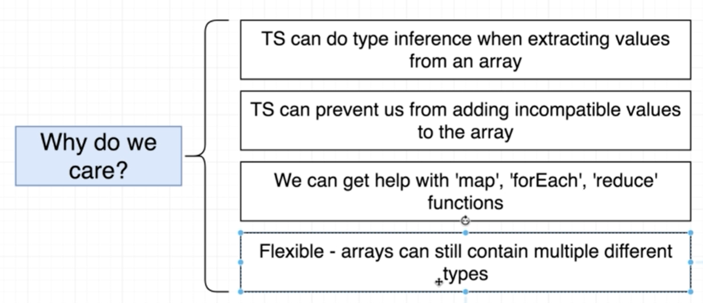

# Mastering Typed Arrays

Typed Array란
* 배열 내부의 각 엘리먼트들이 모순되지 않는 타입의 값을 가지고 있는 배열

```ts
const carMakers = [ 'ford', 'toyota', 'chevy' ];
```
* 위 코드처럼 변수를 초기화 하고 carMakers에 마우스를 올려보면 이 배열은 string 타입의 값들을 가지는 배열로 인퍼런스가 작동하고 있음을 확인할 수 있을 것이다

```ts
const carMakers: string[] = [ 'ford', 'toyota', 'chevy' ];
```
* 물론 위 상황에서는 인퍼런스가 작동함에도 가능하면 어노테이션을 사용해주는 것이 실수를 줄이는 데 좋다

```ts
const carMakers: string[] = [ 'ford', 'toyota', 'chevy' ];
const dates: Date[] = [new Date(), new Date()];
const carByMake: string[][] = [];
```
* string[][]가 다른 것들과 비교해서 특이하게 보일 수 있는데 이는 [['string1'],['string2'],['string3']]와 같은 2차원 배열 안의 값이 string타입임을 지정한 것이다

Typed Array를 사용할 때의 장점


```ts
// Help with inference when extracting values
const car = carMakers[0];
const myCar = carMakers.pop();

// Prevent incompatible values
carMakers.push(100); /* error */

// Help with 'map'
carMakers.map((car: string): string => {
  return car.toUpperCase();
});
```
* 위와 같이 변수 추출, 배열에 새로운 값 추가, map, foreach등 합성함수를 사용할 때 실수를 방지해준다

