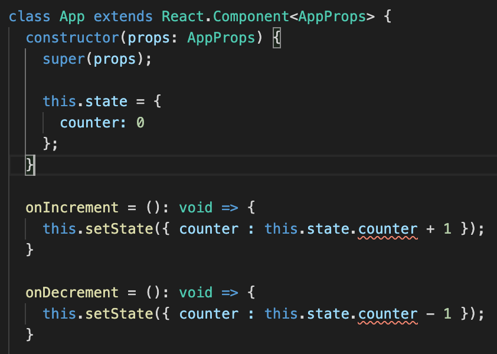
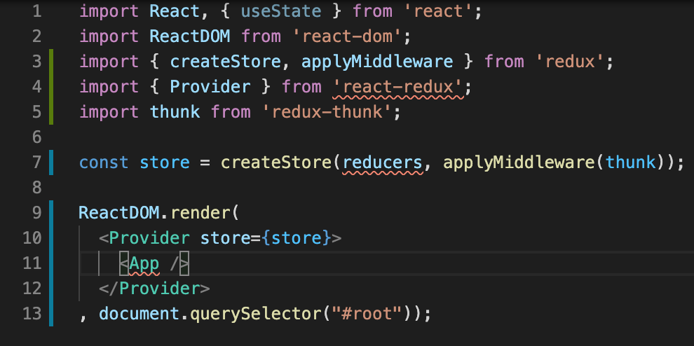
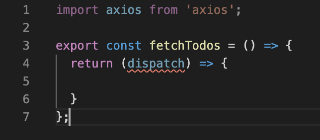

# React and Redux with Typescript

## 리액트 리덕스 환경에서 타입스크립트를 사용할 때의 장단점

장점
1. 오타, 잘못된 액션 타입을 지정했을 때와 같은 기본적인 실수를 줄여준다
2. 데이터의 흐름을 더 쉽게 파악할 수 있게 해준다
3. 리팩토링을 더 쉽게 할 수 있다

단점
1. 타입 설정 파일의 문제
  - 특히 redux는 타입 설정 파일(type definition file)이 최적화되어 있지 않다
2. generic이 제대로 작동하지 않을 때가 있다
3. 너무 많은 임포트와 타입(action creator, action, reducer, store, component)이 필요해서 코드량이 많아지고 결합도가 증가한다
4. 리덕스는 모든 기능이 함수로 되어 있고 fp를 지향하는 반면 타입스크립트는 클래스 중심의 언어기 때문에 다른 라이브러리를 사용할 때 클래스로 작성된 코드가 많은데 이를 같이 사용할 때 결합이 힘든 경우가 있다

---

## 새 프로젝트 생성하기

```terminal
$ npx create-react-app rrts --typescript
```

프로젝트가 생성되면 해당 폴더로 이동한다
```terminal
$ cd rrts
```

밑바닥부터 하나씩 코드를 추가해가며 이해하기 위해 src폴더를 전부 삭제한 후 다시 src폴더를 생성한다
* 그런 다음 src폴더에 index.tsx파일을 생성하고 아래 코드를 추가한다
```tsx
import React from 'react';
import ReactDOM from 'react-dom';

class App extends React.Component {
    render() {
        return <div>Hi there</div>
    }
}

ReactDOM.render(<App />, document.querySelector("#root"));
```

애플리케이션을 실행해서 확인해보자
```terminal
$ npm start
```

---

## Props 사용하기

```tsx
import React from 'react';
import ReactDOM from 'react-dom';

class App extends React.Component {
    render() {
        return <div>{this.props.color}</div>
    }
}

ReactDOM.render(<App color="red" />, document.querySelector("#root"));
```
* App 컴포넌트에 red라는 문자열을 가진 color props를 넘겨준다
* 자바스크립트로 작성된 컴포넌트라면 문제가 없지만 ts에서는 아래와 같이 에러가 발생할 것이다


* TS와 함께 리액트 앱을 작성할 때는 props의 목록과 타입을 지정해줘야 한다
* 일반적으로는 인터페이스를 사용해 이 문제를 해결한다

```tsx
import React from 'react';
import ReactDOM from 'react-dom';

interface AppProps {
    color?: string;
}

class App extends React.Component<AppProps> {
    render() {
        return <div>{this.props.color}</div>
    }
}

ReactDOM.render(<App color="red" />, document.querySelector("#root"));
```
* React.Component에 Generic을 활용해 작성한 인터페이스를 적용한다
* 에러가 사라졌는지 확인해보자
* 필수 props가 아니라면 위와 같이 props명 뒤에 ?마크를 붙여줘야 한다
  - 그렇지 않고 props를 넘겨주지 않으면 에러가 발생한다

---

## State Handling

버튼을 클릭해 counter state를 증가 또는 감소시키는 간단한 코드를 작성했다
```tsx
import React from 'react';
import ReactDOM from 'react-dom';

interface AppProps {
    color?: string;
}

class App extends React.Component<AppProps> {
  state = {
    counter: 0
  };

  onIncrement = (): void => {
    this.setState({ counter : this.state.counter + 1 });
  }

  onDecrement = (): void => {
    this.setState({ counter : this.state.counter - 1 });
  }

  render() {
    return (
      <div>
        <button onClick={this.onIncrement}>Increment</button>
        <button onClick={this.onDecrement}>Decrement</button>
        {this.state.counter}
      </div>
    )
  }
}

ReactDOM.render(<App />, document.querySelector("#root"));
```
* 얼핏 보기엔 아무런 문제도 없는 매우 명확하고 간단한 코드이지만 내부적으로는 상당히 복잡한 문제들이 있다

---

## Confusing Component State

state선언 문법
```js
class App extends React.Component<AppProps> {
  constructor(props: AppProps) {
    super(props);

    this.state = {
      counter: 0
    };
  }

  /* (...) */
}
```
* 일반적인 자바스크립트 클래스 문법이라면 위와 같이 생성자 안에서 멤버변수를 선언한다
* 위 코드는 앞서 보았던 코드와 정확히 같은 동작을 하는 코드다
* 그런데 실제로 위와 같이 코드를 고쳐보면 에러가 발생하고 있는 것을 확인할 수 있을 것이다
* 이는 타입스크립트에서 두 가지 멤버변수 선언방식이 다르게 동작하기 때문이다


* 마우스를 에러가 발생한 곳에 올려놓으면 Property 'counter' does not exist on type 'Readonly<{}>'.ts(2339)라는 에러가 나올 것이다
* 이는 리액트 컴포넌트 스테이트의 초기값이 아무런 타입이 없는 빈 값이기 때문에 발생하는 에러다
* 앞서 선언했던 방식과 생성자를 선언하는 방식의 차이점이 여기서 드러난다
* 앞서 선언했던 방식은 읽기전용으로 동작하지 않고 스테이트를 재정의한다
* 재정의에 의해 기존 리액트 컴포넌트 스테이트의 타입을 사용하지 않고 재정의한 타입으로 변경되어 에러가 발생하지 않았던 것이다

생성자를 이용한 방식을 사용하면서 에러 없애기
```tsx
import React from 'react';
import ReactDOM from 'react-dom';

interface AppProps {
  color?: string;
}

interface AppState {
  counter: number;
}

class App extends React.Component<AppProps, AppState> {
  constructor(props: AppProps) {
    super(props);

    this.state = {
      counter: 0
    };
  }

  onIncrement = (): void => {
    this.setState({ counter : this.state.counter + 1 });
  }

  onDecrement = (): void => {
    this.setState({ counter : this.state.counter - 1 });
  }

  render() {
    return (
      <div>
        <button onClick={this.onIncrement}>Increment</button>
        <button onClick={this.onDecrement}>Decrement</button>
        {this.state.counter}
      </div>
    )
  }
}

ReactDOM.render(<App />, document.querySelector("#root"));
```
* React.Component에 제네릭을 사용해 두 번째 인자로 스테이트의 타입을 정의할 수 있다
* 그럼 생성자를 사용하더라도 멤버변수의 타입이 재정의된다

---

## Functional Components with TS

클래스 기반 컴포넌트와 같은 기능을 하는 코드를 함수형 컴포넌트로 만들어 보기
```tsx
import React, { useState } from 'react';
import ReactDOM from 'react-dom';

interface AppProps {
  color?: string;
}

const App = (props: AppProps): JSX.Element => {
  const [counter, setCounter]: [number, Function] = useState(0);

  const onIncrement = (): void => {
    setCounter(counter + 1);
  }

  const onDecrement = (): void => {
    setCounter(counter - 1);
  }

  return (
    <div>
      <button onClick={onIncrement}>Increment</button>
      <button onClick={onDecrement}>Decrement</button>
      {counter}
      <br />
      {props.color}
    </div>
  );
}

ReactDOM.render(<App color="red" />, document.querySelector("#root"));
```
* 다른 내용들은 큰 차이가 없으나 반환 타입을 JSX.Element로 설정하는 것을 알아두자

---

# Setup Redux 

다음 패키지들을 설치해준다
```terminal
$ npm i redux react-reudx axios redux-thunk
```

index.tsx파일을 수정하기
```tsx
import React, { useState } from 'react';
import ReactDOM from 'react-dom';
import { createStore, applyMiddleware } from 'redux';
import { Provider } from 'react-redux';
import thunk from 'redux-thunk';

const store = createStore(reducers, applyMiddleware(thunk));

ReactDOM.render(
  <Provider store={store}>
    <App />
  </Provider>
, document.querySelector("#root"));
```
* createStore는 앱 전체에서 사용할 스토어를 생성한다
* applyMiddleware의 인자로 thunk를 보내 액션 크리에이터 내부에서 비동기 작업을 처리할 수 있도록 만든다
* Provider로 생성한 리덕스 스토어 및 적용된 미들웨어로 애플리케이션 전체를 래핑한다

타입 데피니션 파일

* 임포트 부분을 보면 redux와 redux-thunk패키지는 타입 정의 파일을 제공해주고 있어 에러가 발생하지 않는다
* 그러나 react-redux처럼 타입 정의 파일을 기본으로 포함시키지 않고 있는 패키지는 따로 파일을 받거나 직접 생성해주어야 한다

Installing type definition file of react-redux
```terminal
$ npm install @types/react-redux
```
* 설치가 완료되면 더 이상 임포트 부분에 에러가 발생하지 않는 것을 확인할 수 있을 것이다

App컴포넌트 작성하기
* src/components폴더를 생성하고 폴더 내부에 App.tsx파일을 생성한다
```tsx
import React from 'react';

export class App extends React.Component {
  render() {
    return <div>Hi there!</div>
  }
}
```

Reducer생성하기
* src/reducers폴더를 생성하고 폴더 내부에 index.ts파일을 생성한다
```tsx
import { combineReducers } from 'redux';

export const reducers = combineReducers({
  counter: () => 1
});
```

index.tsx파일에서 생성한 App컴포넌트와 Reducer불러오기
```tsx
import React, { useState } from 'react';
import ReactDOM from 'react-dom';
import { createStore, applyMiddleware } from 'redux';
import { Provider } from 'react-redux';
import thunk from 'redux-thunk';

import { App } from './components/App';
import { reducers } from './reducers/index';

const store = createStore(reducers, applyMiddleware(thunk));

ReactDOM.render(
  <Provider store={store}>
    <App />
  </Provider>
, document.querySelector("#root"));
```
* 이제 모든 에러가 사라진 것을 확인할 수 있을 것이다

---

## Action Creators with Typescript

더미 데이터를 받아오기 위해 액션 크리에이터 작성하기
* src/actions폴더를 생성하고 생성된 폴더 내부에 index.ts파일을 생성한다
```ts
import axios from 'axios';

export const fetchTodos = () => {
  return (dispatch) => {
    
  }
};
```
* 위와 같은 코드가 redux thunk의 기본 형식이다
  - 액션 내부에서 한 번 더 함수를 리턴하는데 인자로 오는 dispatch함수로 작업을 처리하는 흐름이다
* 그런데 위와 같은 코드를 작성하면 dispatch에 에러가 발생하고 있는 것을 확인할 수 있을 것이다



redux의 Dispatch타입을 임포트해 에러 해결하기
```ts
import axios from 'axios';
import { Dispatch } from 'redux';

export const fetchTodos = () => {
  return (dispatch: Dispatch) => {
    
  }
};
```
* 에러가 사라진 것을 확인할 수 있을 것이다

todo list목록을 받아오는 코드 작성하기
```ts
import axios from 'axios';
import { Dispatch } from 'redux';

const url = "https://jsonplaceholder.typicode.com/todos";

export const fetchTodos = () => {
  return async (dispatch: Dispatch) => {
    const response = await axios.get(url);

    dispatch({
      type: 'FETCH_TODOS',
      payload: response.data
    })
  }
};
```
* 동작 자체는 올바르게 작동하는 코드다
* 그런데 위 코드의 response부분처럼 어떤 타입의 데이터를 받아오는지 알 수 없는 부분들이 남아있다
* 게다가 dispatch 내부의 type은 하드코딩된 문자열로 되어 있다
  - 이는 enum으로 처리하는 것이 바람직하다

---

## Actions Types Enum

우선 axios로 받아오는 데이터의 타입을 지정해주기 위해 interface를 작성한다
```ts
import axios from 'axios';
import { Dispatch } from 'redux';

const url = "https://jsonplaceholder.typicode.com/todos";

interface Todo {
  id: number;
  title: string;
  completed: boolean;
}

export const fetchTodos = () => {
  return async (dispatch: Dispatch) => {
    const response = await axios.get<Todo[]>(url);

    dispatch({
      type: 'FETCH_TODOS',
      payload: response.data
    })
  }
};
```
* 작성된 인터페이스로 axios메소드에 제네릭을 지정해준다

enum을 사용해 하드코딩된 디스패치 타입 수정하기
* src/actions 폴더 안에 types.ts파일을 생성하고 다음과 같은 코드를 추가한다
```ts
export enum ActionTypes {
  fetchTodos
}
```
* src/actions/index.ts 파일에 하드코딩되어 있던 문자열을 교체한다
```ts
import axios from 'axios';
import { Dispatch } from 'redux';

import { ActionTypes } from './types';

const url = "https://jsonplaceholder.typicode.com/todos";

interface Todo {
  id: number;
  title: string;
  completed: boolean;
}

export const fetchTodos = () => {
  return async (dispatch: Dispatch) => {
    const response = await axios.get<Todo[]>(url);

    dispatch({
      type: ActionTypes.fetchTodos,
      payload: response.data
    })
  }
};
```

---

## The Generic Dispatch Function

디스패치의 인자의 인터페이스 작성하기(Option)
* 필수는 아니지만 추가하면 에러를 방지하기 좋은 옵션이다

```ts
import axios from 'axios';
import { Dispatch } from 'redux';

import { ActionTypes } from './types';

const url = "https://jsonplaceholder.typicode.com/todos";

interface Todo {
  id: number;
  title: string;
  completed: boolean;
}

interface FetchTodosAction {
  type: ActionTypes.fetchTodos;
  payload: Todo[];
}

export const fetchTodos = () => {
  return async (dispatch: Dispatch) => {
    const response = await axios.get<Todo[]>(url);

    dispatch<FetchTodosAction>({
      type: ActionTypes.fetchTodos,
      payload: response.data
    })
  }
};
```
* FetchTodosAction 인터페이스를 만들어 dispatch에 제네릭을 지정해줬다
* 위와 같은 간단한 코드에서는 이런 방식이 큰 이점이 없다고 느끼기 쉽다
* 그러나 await와 if와 같은 제어문이 난무하는 복잡한 코드를 작성해야 하는 경우에는 dispatch의 인자로 넘기는 오브젝트가 최종적으로 어떤 종류의 데이터인지 헷갈리는 경우가 많다
* 위와 같이 인터페이스를 생성해서 적용해주면 복잡한 로직이 필요한 경우에 실수를 많이 줄여줄 수 있다

---

## A Reducer with Enums

액션을 처리할 리듀서 작성하기
* src/reducers 폴더에 todos.ts파일을 만들고 다음 내용을 입력한다
```ts
import { Todo, FetchTodosAction } from '../actions/index';
import { ActionTypes } from '../actions/types';

export const todosReducer = (
  state: Todo[] = [], 
  action: FetchTodosAction
) => {
  switch (action.type) {
    case ActionTypes.fetchTodos:
      return action.payload;
    default:
      return state;  
  }  
};
```
* 리듀서는 state, action 두 개의 인자를 받는다
* state가 넘어오지 않는 경우 인자의 기본값으로 지정한 빈 배열이 state값이 된다
* 앞서 작성했던 액션타입과 state의 인터페이스(여기서는 Todo)를 사용하고 있다
* 이렇게 명확하게 정의한 타입들을 사용하면 쉽게 자동완성이 되도록 IDE나 텍스트 에디터의 도움을 받을 수 있다
* 또, 어떤 형태의 state, action이 사용되는 리듀서인지 코드의 예측 가능성도 높아진다

---

## Validating Store Structure

앞서 생성한 리듀서를 적용하기
* src/reducers/index.ts파일에 combineReducers에 앞서 만든 리듀서를 적용해준다
```ts
import { combineReducers } from 'redux';
import { todosReducer } from './todos';

export const reducers = combineReducers({
  todos: todosReducer
});
```

액션과 마찬가지로 combineReducers에도 제네릭을 적용하기
```ts
import { combineReducers } from 'redux';
import { todosReducer } from './todos';
import { Todo } from '../actions';

export interface StoreState {
  todos: Todo[]
};

export const reducers = combineReducers<StoreState>({
  todos: todosReducer
});
```
* 위와 같이 제네릭을 적용하면 실제로 todosReducers가 Todo[]타입이 아닌 다른 값을 반환하고 있을 시 에러를 발생시켜 알려준다
* 이처럼 combineReducers에도 제네릭을 사용해 실수를 줄일 수 있다

---

## Connecting a Component to Redux

지금까지 작성한 리덕스 코드들을 실제로 컴포넌트와 연결하기
* src/components/App.tsx 파일을 다음과 같이 수정한다
```tsx
import React from 'react';
import { connect } from 'react-redux';
import { Todo, fetchTodos } from '../actions';
import { StoreState } from '../reducers';

interface AppProps {
  todos: Todo[];
  fetchTodos(): any;
}

class _App extends React.Component<AppProps> {
  render() {
    return <div>Hi there!</div>
  }
}

const mapStateToProps = ({ todos }: StoreState): { todos: Todo[] } => {
  return { todos };
};

export const App = connect(mapStateToProps, { fetchTodos })(_App);
```
* 기존 App컴포넌트는 connect에 의해 커링되므로 _App으로 이름을 바꿔 구분하기 쉽게 만든다
* 제네릭을 활용해 컴포넌트가 사용할 state와 reducer를 지정한다
* react-redux패키지의 connect함수로 이 모든 것들을 연결시켜준다

---

## Rendering a List

보조함수를 만들어 리덕스로 받아온 데이터를 렌더링하기
```tsx
import React from 'react';
import { connect } from 'react-redux';
import { Todo, fetchTodos } from '../actions';
import { StoreState } from '../reducers';

interface AppProps {
  todos: Todo[];
  fetchTodos(): any;
}

class _App extends React.Component<AppProps> {
  onButtonClick = (): void => {
    this.props.fetchTodos();    
  }

  renderList = (): JSX.Element[] => {
    return this.props.todos.map((todo: Todo) => {
      return <div key={todo.id}>{todo.title}</div>
    });
  }

  render() {
    return (
      <div>
        <button onClick={this.onButtonClick}>Fetch</button>
        {this.renderList()}
      </div>
    );
  }
}

const mapStateToProps = ({ todos }: StoreState): { todos: Todo[] } => {
  return { todos };
};

export const App = connect(mapStateToProps, { fetchTodos })(_App);
```

---

## Adding in Delete Functionality

Todo를 삭제하는 로직 작성하기
1. 액션 타입 정의하기
```ts
// src/actions/types.ts

export enum ActionTypes {
  fetchTodos,
  deleteTodo
}
```

2. 인터페이스를 정의하기
```ts
// src/actions/index.ts

export interface DeleteTodoAction {
  type: ActionTypes.deleteTodo;
  payload: number;
}
```
* payload에 Todo전체를 넣을 필요는 없기 때문에 number를 지정했다

3. 액션 크리에이터 작성하기
```ts
// src/actions/index.ts

export const deleteTodo = (id: number): DeleteTodoAction => {
  return {
    type: ActionTypes.deleteTodo,
    payload: id
  };
};
```

---