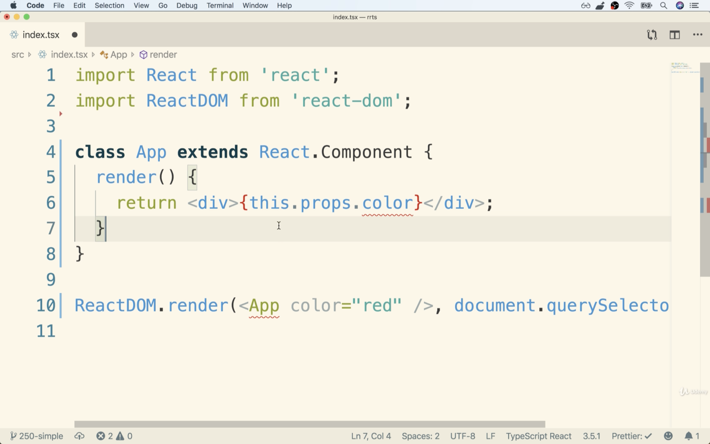

# React and Redux with Typescript

## 리액트 리덕스 환경에서 타입스크립트를 사용할 때의 장단점

장점
1. 오타, 잘못된 액션 타입을 지정했을 때와 같은 기본적인 실수를 줄여준다
2. 데이터의 흐름을 더 쉽게 파악할 수 있게 해준다
3. 리팩토링을 더 쉽게 할 수 있다

단점
1. 타입 설정 파일의 문제
  - 특히 redux는 타입 설정 파일(type definition file)이 최적화되어 있지 않다
2. generic이 제대로 작동하지 않을 때가 있다
3. 너무 많은 임포트와 타입(action creator, action, reducer, store, component)이 필요해서 코드량이 많아지고 결합도가 증가한다
4. 리덕스는 모든 기능이 함수로 되어 있고 fp를 지향하는 반면 타입스크립트는 클래스 중심의 언어기 때문에 다른 라이브러리를 사용할 때 클래스로 작성된 코드가 많은데 이를 같이 사용할 때 결합이 힘든 경우가 있다

---

## 새 프로젝트 생성하기

```terminal
$ npx create-react-app rrts --typescript
```

프로젝트가 생성되면 해당 폴더로 이동한다
```terminal
$ cd rrts
```

밑바닥부터 하나씩 코드를 추가해가며 이해하기 위해 src폴더를 전부 삭제한 후 다시 src폴더를 생성한다
* 그런 다음 src폴더에 index.tsx파일을 생성하고 아래 코드를 추가한다
```tsx
import React from 'react';
import ReactDOM from 'react-dom';

class App extends React.Component {
    render() {
        return <div>Hi there</div>
    }
}

ReactDOM.render(<App />, document.querySelector("#root"));
```

애플리케이션을 실행해서 확인해보자
```terminal
$ npm start
```

---

## Props 사용하기

```tsx
import React from 'react';
import ReactDOM from 'react-dom';

class App extends React.Component {
    render() {
        return <div>{this.props.color}</div>
    }
}

ReactDOM.render(<App color="red" />, document.querySelector("#root"));
```
* App 컴포넌트에 red라는 문자열을 가진 color props를 넘겨준다
* 자바스크립트로 작성된 컴포넌트라면 문제가 없지만 ts에서는 아래와 같이 에러가 발생할 것이다


* TS와 함께 리액트 앱을 작성할 때는 props의 목록과 타입을 지정해줘야 한다
* 일반적으로는 인터페이스를 사용해 이 문제를 해결한다

```tsx
import React from 'react';
import ReactDOM from 'react-dom';

interface AppProps {
    color?: string;
}

class App extends React.Component<AppProps> {
    render() {
        return <div>{this.props.color}</div>
    }
}

ReactDOM.render(<App color="red" />, document.querySelector("#root"));
```
* React.Component에 Generic을 활용해 작성한 인터페이스를 적용한다
* 에러가 사라졌는지 확인해보자
* 필수 props가 아니라면 위와 같이 props명 뒤에 ?마크를 붙여줘야 한다
  - 그렇지 않고 props를 넘겨주지 않으면 에러가 발생한다

---
