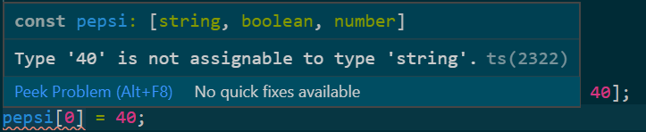

# Tuple

튜플
* 배열 같이 연속된 자료 안에 여러 타입의 값이 있을 때 규칙성을 유지하기
```ts
const pepsi = ['brown', true, 40];
pepsi[0] = 40;
pepsi[2] = 'brown';
```
* 위와 같은 코드에서는 배열 안의 순서에 대한 어떤 규칙도 없기 때문에 배열의 위치를 변경할 수 있다

```ts
const pepsi: [string, boolean, number] = ['brown', true, 40];
pepsi[0] = 40;
```
* 위 코드처럼 애노테이션으로 배열 안의 값들의 순서에 따른 타입을 지정하면 특정 인덱스에는 지정된 타입 외의 값은 넣을 수 없다



튜플의 타입을 별도로 선언하기
```ts
type Drink = [string, boolean, number];

const pepsi: Drink = ['brown', true, 40];
const sprite: Drink = ['clear', true, 40];
const tea: Drink = ['green', false, 0];
```
* 위 코드처럼 type 키워드 튜플명 = [타입1, 타입2, ...]형태로 작성하면 애노테이션처럼 사용할 수 있다
* 이와 같이 사용하는 편이 재사용성을 높이는 더 좋은 방법이다

