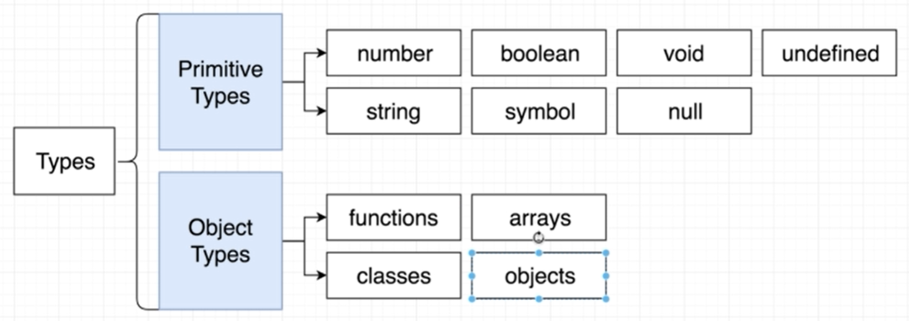
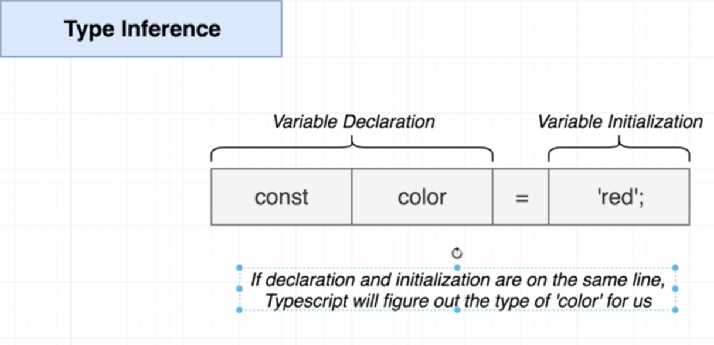
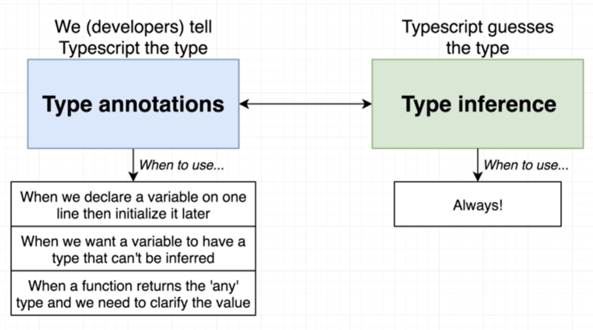

# Type annotations

타입 어노테이션(Type annotation)이란

- 타입스크립트에 변수가 참조할 값의 타입을 알려주는 것

타입 인퍼런스(Type inference)

- 타입스크립트가 변수가 어떤 타입의 값을 참조하는지 알려주는 것

위 둘의 차이점

- 주체가 다르다
  - 타입 어노테이션은 개발자가 코드로 타입스크립트에 지정하는 것
  - 타입 인퍼런스는 타입스크립트가 하는 것

예시

```ts
const apples: number = 5;
```

- 위 코드에서 콜론(:) 타입(number) 형식으로 apples라는 변수에 참조할 값의 타입을 알려주고 있다

```ts
const apples: number = true; /* error */
```

- 위와 같이 다른 타입의 값을 대입하면 에러가 발생한다

number 이외에도 다양한 타입의 타입 어노테이션을 선언할 수 있다

```ts
let speed: string = 'fast';
let hasName: boolean = true;

let nothingMuch: null = null;
let nothing: undefined = undefined;

// built in objects
let now: Date = new Date();
```



---

배열과 타입 어노테이션

```ts
// Array
let colors: string[] = ['red', 'green', 'blue'];
let myNumbers: number[] = [1, 2, 3];
let truths: boolean[] = [true, true, false];
```

- 위와 같이 콜론(:) 타입(string, number, boolean, etc...)[]의 형식으로 작성한다

클래스와 타입 어노테이션

```ts
// Classes
class Car {}

let car: Car = new Car();
```

- 변수명과 클래스명이 대문자, 소문자 구분을 제외하면 똑같기 때문에 헷갈릴 수 있다
- 이 문제는 클래스의 첫 문자를 대문자로 사용하는 컨벤션으로 해결한다

오브젝트 리터럴과 타입 어노테이션

```ts
// Object literal
let point: { x: number; y: number } = {
  x: 10,
  y: 20,
};
```

- { key1: type of key1; key2: type of key2; etc... }의 형식으로 작성한다

함수와 타입 어노테이션

```ts
// Function
const logNumber: (i: number) => void = (i: number) => {
  console.log(i);
};
```

- 함수명 콜론(:) (파라미터: 타입) => 반환 타입 형식으로 사용한다

---

타입 어노테이션이 사라지면 코드는 작동하지 않게 될까?

```ts
let apples = 5;
let speed = 'fast';
let hasName = true;
let nothingMuch = null;
let nothing = undefined;
```

- 위 코드처럼 타입 어노테이션을 지워도 에러는 발생하지 않는다
- 또한 각각의 변수 위에 마우스를 올려놓아보면 각 변수의 타입도 초기값에 따라 잘 인식되고 있음을 알 수 있다
- 이렇게 초기값의 선언을 통해 타입스크립트가 각 변수의 타입이 추측하는 것이 type inference다

타입 인퍼런스(Type inference)


그렇다면 언제 타입 어노테이션을 사용하고 언제 타입 인퍼런스를 사용하면 될까


- 위와 같이 상황에 따라 대처할 수 있다
