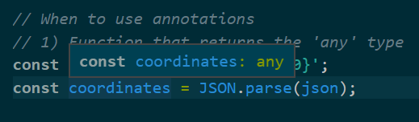
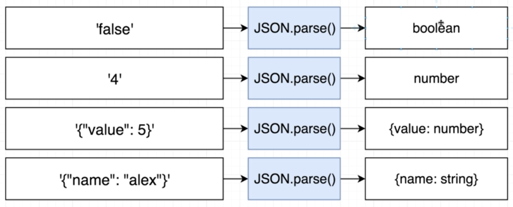
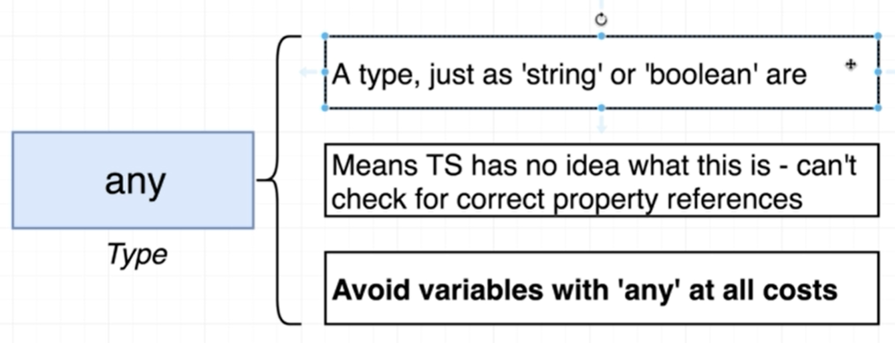
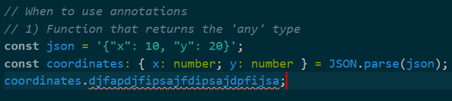
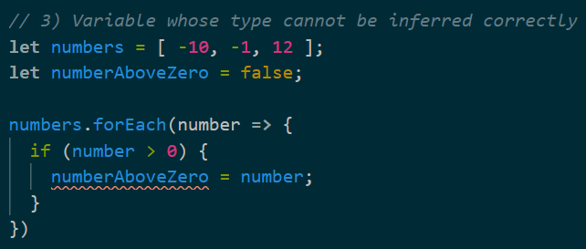

# Type annotations

타입 어노테이션(Type annotation)이란

- 타입스크립트에 변수가 참조할 값의 타입을 알려주는 것

타입 인퍼런스(Type inference)

- 타입스크립트가 변수가 어떤 타입의 값을 참조하는지 알려주는 것

위 둘의 차이점

- 주체가 다르다
  - 타입 어노테이션은 개발자가 코드로 타입스크립트에 지정하는 것
  - 타입 인퍼런스는 타입스크립트가 하는 것

예시

```ts
const apples: number = 5;
```

- 위 코드에서 콜론(:) 타입(number) 형식으로 apples라는 변수에 참조할 값의 타입을 알려주고 있다

```ts
const apples: number = true; /* error */
```

- 위와 같이 다른 타입의 값을 대입하면 에러가 발생한다

number 이외에도 다양한 타입의 타입 어노테이션을 선언할 수 있다

```ts
let speed: string = 'fast';
let hasName: boolean = true;

let nothingMuch: null = null;
let nothing: undefined = undefined;

// built in objects
let now: Date = new Date();
```


---

배열과 타입 어노테이션

```ts
// Array
let colors: string[] = ['red', 'green', 'blue'];
let myNumbers: number[] = [1, 2, 3];
let truths: boolean[] = [true, true, false];
```

- 위와 같이 콜론(:) 타입(string, number, boolean, etc...)[]의 형식으로 작성한다

클래스와 타입 어노테이션

```ts
// Classes
class Car {}

let car: Car = new Car();
```

- 변수명과 클래스명이 대문자, 소문자 구분을 제외하면 똑같기 때문에 헷갈릴 수 있다
- 이 문제는 클래스의 첫 문자를 대문자로 사용하는 컨벤션으로 해결한다

오브젝트 리터럴과 타입 어노테이션

```ts
// Object literal
let point: { x: number; y: number } = {
  x: 10,
  y: 20,
};
```

- { key1: type of key1; key2: type of key2; etc... }의 형식으로 작성한다

함수와 타입 어노테이션

```ts
// Function
const logNumber: (i: number) => void = (i: number) => {
  console.log(i);
};
```

- 함수명 콜론(:) (파라미터: 타입) => 반환 타입 형식으로 사용한다

---

타입 어노테이션이 사라지면 코드는 작동하지 않게 될까?

```ts
let apples = 5;
let speed = 'fast';
let hasName = true;
let nothingMuch = null;
let nothing = undefined;
```

- 위 코드처럼 타입 어노테이션을 지워도 에러는 발생하지 않는다
- 또한 각각의 변수 위에 마우스를 올려놓아보면 각 변수의 타입도 초기값에 따라 잘 인식되고 있음을 알 수 있다
- 이렇게 초기값의 선언을 통해 타입스크립트가 각 변수의 타입이 추측하는 것이 type inference다

타입 인퍼런스(Type inference)


그렇다면 언제 타입 어노테이션을 사용하고 언제 타입 인퍼런스를 사용하면 될까


- 위와 같이 상황에 따라 대처할 수 있다

---

any타입

```ts
// When to use annotations
// 1) Function that returns the 'any' type
const json = '{"x": 10, "y": 20}';
const coordinates = JSON.parse(json);
```

- 위 코드와 같이 json형식의 데이터를 해석하는 JSON.parse함수로 데이터를 변환해보자
- 그런 다음 coordinates 변수 위에 마우스를 올려놓아 TS가 어떻게 coordinates를 추론하는지 확인해보자



- 위에서 배웠던 대로 object literal이라면 {x: number; y: number;} 형식으로 추론되어야 할 것 같지만 any타입으로 추론되고 있음을 확인할 수 있다
- 왜 이런 현상이 일어나는 것일까



- 위 그림과 같이 JSON.parse함수는 매우 다양한 타입의 값을 해석해 반환할 수 있다
- 그런데 해석대상으로 들어오는 파라미터는 항상 문자열 타입이다
- 이런 규칙성이 없는 상황에서는 타입스크립트가 JSON.parse를 호출한 결과가 정확히 무엇인지를 예측할 수 없다
- 이렇게 값의 타입을 정확히 예측할 수 없는 상황에 대해 타입스크립트는 any타입을 사용해 해결한다



- 위처럼 예측할 수 없는 상황에 대해 에러를 발생시키지 않기 위해서 any를 사용할 수 있다
- 그러나 애플리케이션 전반에 any 타입을 사용하면 에러가 있을 때에도 타입스크립트 컴파일러가 에러를 잡아낼 수 없게 된다
- 따라서 any는 정말 불가피한 상황이 아니라면 사용하지 않는 것이 좋다
- 예를 들어 다음과 같은 코드를 보면 그 문제점을 알 수 있다

```ts
// When to use annotations
// 1) Function that returns the 'any' type
const json = '{"x": 10, "y": 20}';
const coordinates = JSON.parse(json);
coordinates.djfapdjfipsajfdipsajdpfijsa; // Not occured error
```

- 실제로는 없는 프로퍼티명(djfapdjfipsajfdipsajdpfijsa)을 사용하고 있음에도 에러를 발생시키지 않는다
- 이처럼 any타입이 많아지면 애플리케이션 전반에 예측할 수 없는 부분이 늘어난다

타입 어노테이션을 사용해 위 문제를 해결하기


- 앞서 Object literal에 사용했던 방식대로 어노테이션을 사용하면 해결할 수 있다

---

변수를 선언만 하고 초기값을 지정하지 않는 경우

```ts
// 2) When we declare a variable on one line
// and initialize it later
let words = ['red', 'green', 'blue'];
let foundWord;

words.forEach((word) => {
  if (word === 'green') foundWord = true;
});
```

- 위 코드와 같이 특정 변수의 값을 초기화하지 않고 분기문에 따라 지정하려고 하는 상황이 있을 수 있다
- 이 때에도 어노테이션을 사용하면 예측하지 못한 값이 변수에 대입되었을 때 타입스크립트가 에러를 발생시켜준다

```ts
let words = ['red', 'green', 'blue'];
let foundWord: boolean; // annotation

words.forEach((word) => {
  if (word === 'green') foundWord = true;
});
```

---

한 변수가 두 개의 타입의 값을 가진다면?

- 타입 인퍼런스만으로는 변수의 변화에 제대로 대응할 수 없다
- 예를 들어 다음과 같은 코드를 보자



- 초기에 numberAboveZero는 0을 넘는 값이 없음으로 선언하기 위해 boolean값을 가지고 있다
- 이후 0이 넘는 숫자가 있으면 해당 값을 대입한다
- 즉, numberAboveZero는 boolean타입이거나 number타입이다
- 하지만 초기화와 동시에 추론이 결정되는 인퍼런스만으로는 이 상황에 제대로 대응할 수 없다

타입 어노테이션으로 해결하기

```ts
// 3) Variable whose type cannot be inferred correctly
let numbers = [-10, -1, 12];
let numberAboveZero: boolean | number = false;

numbers.forEach((number) => {
  if (number > 0) {
    numberAboveZero = number;
  }
});
```

- 변수명: 타입1 | 타입2 의 형식으로 |(OR)을 사용해 여러 타입을 지정하는 것으로 해결할 수 있다
